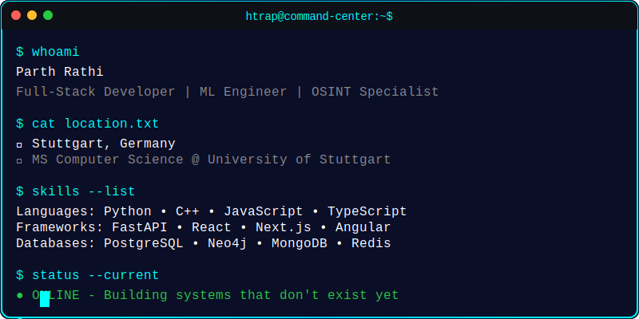

<div align="center">



</div>

---

```bash
┌──[COMMAND CENTER]─[ONLINE]──────────────────────────────────────────────┐
│ System Status: ● ACTIVE                                                 │
│ Location: Stuttgart, Germany                                            │
│ Mission: Building systems that don't exist yet                          │
└─────────────────────────────────────────────────────────────────────────┘
```

## ⚡ QUICK COMMANDS

```bash
$ ./connect.sh --social
```

<div align="center">

[](https://htrap1211.vercel.app)
[](https://www.linkedin.com/in/htrap1211/)
[](https://github.com/htrap1211)
[](mailto:htrap1211@icloud.com)


</div>

```bash
$ cat tech_stack.json
```

<div align="center">

### 💻 CORE SYSTEMS


</div>

```bash
$ ./projects --open --featured
```

## 🎯 ACTIVE MISSIONS

<table>
<tr>
<td width="50%">

```yaml
project: GraphX-OSINT
status: ● PRODUCTION
priority: HIGH
```

**Real-time Threat Intelligence Platform**

Advanced OSINT investigation platform with 10+ intelligence providers, risk scoring engine, and interactive graph workspace.

**Tech Stack:**
- `FastAPI` `Neo4j` `Celery` `Next.js`
- Distributed enrichment pipelines
- Real-time graph analytics
- PDF report generation

```bash
[████████████████░░░░] 80% Complete
```

</td>
<td width="50%">

```yaml
project: Phishing-Detection
status: ● DEPLOYED
priority: HIGH
```

**ML-Powered Security System**

Real-time phishing detection using machine learning and threat intelligence APIs with browser extension.

**Tech Stack:**
- `ML` `FastAPI` `PostgreSQL`
- Google Safe Browsing API
- VirusTotal integration
- Browser extension UI

```bash
[████████████████████] 100% Deployed
```

</td>
</tr>

<tr>
<td width="50%">

```yaml
project: ACL-MetaExplorer
status: ● COMPLETE
priority: MEDIUM
```

**Research Analytics Tool**

Graph-based research analytics with TF-IDF analysis and citation network modeling.

**Tech Stack:**
- `Python` `Streamlit` `Neo4j`
- TF-IDF text analysis
- Citation networks
- Interactive visualizations

```bash
[████████████████████] 100% Complete
```

</td>
<td width="50%">

```yaml
project: Neuralipnet
status: ● OPTIMIZED
priority: MEDIUM
```

**Real-time Lip Reading AI**

Deep learning model for real-time lip-reading with 75% accuracy on custom dataset.

**Tech Stack:**
- `TensorFlow` `OpenCV`
- Real-time video processing
- Custom dataset training
- Optimized inference

```bash
[█████████████████░░░] 95% Optimized
```

</td>
</tr>
</table>

```bash
$ git log --experience
```

## 💼 EXPERIENCE LOG

```log
commit a1b2c3d4 (HEAD -> main)
Author: Parth Rathi <htrap1211@icloud.com>
Date:   Jul 2023 - Jan 2024

    feat: Software Engineering Intern @ BARC
    
    Organization: Bhabha Atomic Research Centre
    Location: Mumbai, India
    Project: Radiation Spectrum Analysis System
    
    Performance Improvements:
    + Processing speed: +20%
    + Load time: -25%
    + Response time: -40%
    + Data retrieval: +35%
    + Throughput: 50K+ data points/hour
    
    Tech Stack: Python | FastAPI | PostgreSQL | Angular | Redis | UART
    
    Impact: System used by researchers at India's premier nuclear
            research facility for radiation spectrum analysis
```

```bash
$ metrics --github --live
```

## 📊 SYSTEM METRICS

<div align="center">


</div>

```bash
$ ./matrix --rain --contributions
```

<div align="center">



</div>

```bash
$ status --current --verbose
```

## 🎯 CURRENT STATUS

```yaml
focus:
  primary:
    - Building OSINT intelligence platforms
    - Optimizing ML models for production
    - Exploring cybersecurity and threat detection
  
  education:
    - Master's in Computer Science @ University of Stuttgart
  
  availability: OPEN_TO_COLLABORATIONS

progress:
  OSINT_Platform:    "████████████████░░░░ 80%"
  ML_Optimization:   "████████████░░░░░░░░ 60%"
  DevOps_Skills:     "██████████████░░░░░░ 70%"

mission_statement: |
  > Decoding reality through code
  > Building systems that don't exist yet
  > Breaking limits, one algorithm at a time
```

---

<div align="center">

```bash
┌──[END OF TRANSMISSION]──────────────────────────────────────────────────┐
│                                                                          │
│  "The best way to predict the future is to invent it."                  │
│                                                                          │
│  System ready for next command...                                       │
│                                                                          │
└──────────────────────────────────────────────────────────────────────────┘
```

[](https://htrap1211.vercel.app)

```bash
$ logout
Connection to command-center closed.
```

</div>
